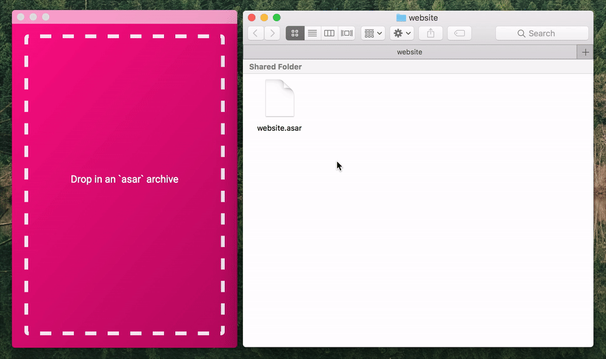

<div align="center">
  <br><br>
</div>

<p align="center">
  <em>Now you can snoop through all the electron apps</em>
</p>

<p align="center">
  
</p>

---

This project is still in development, but most core functionality is ready to use.

#### Build Setup

``` bash
# install dependencies
yarn install

# serve with hot reload at localhost:9080
yarn run dev

# build electron app for production
yarn run build
```

---

This project was generated from [electron-vue](https://github.com/SimulatedGREG/electron-vue) using [vue-cli](https://github.com/vuejs/vue-cli). Documentation about this scaffold can be found [here](https://simulatedgreg.gitbooks.io/electron-vue/content/index.html).
